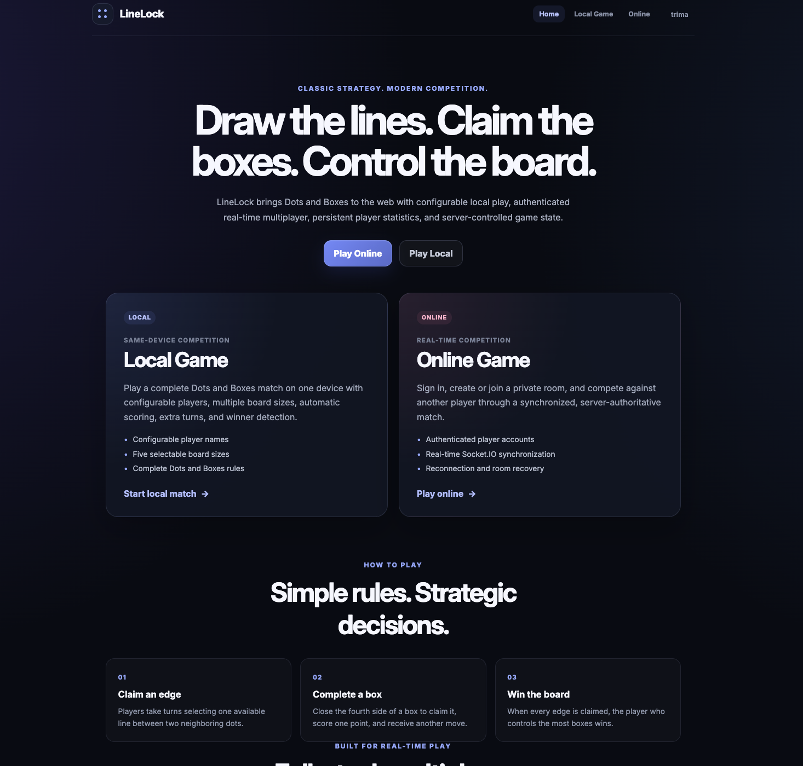
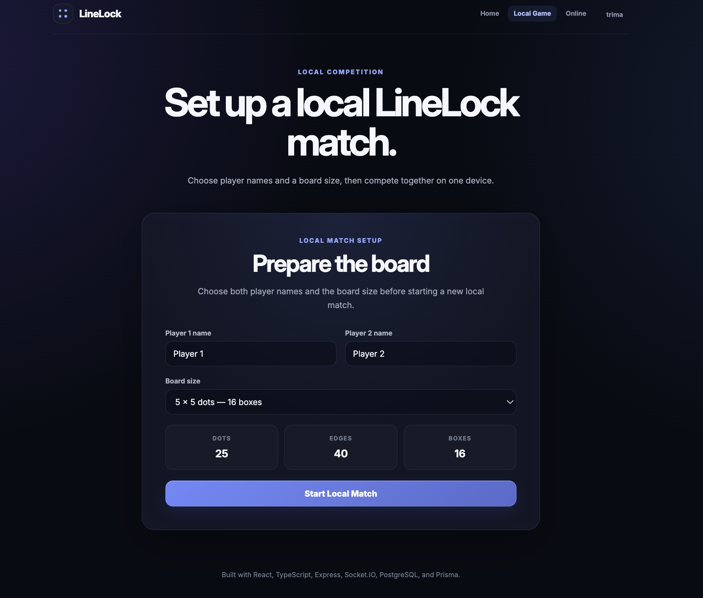
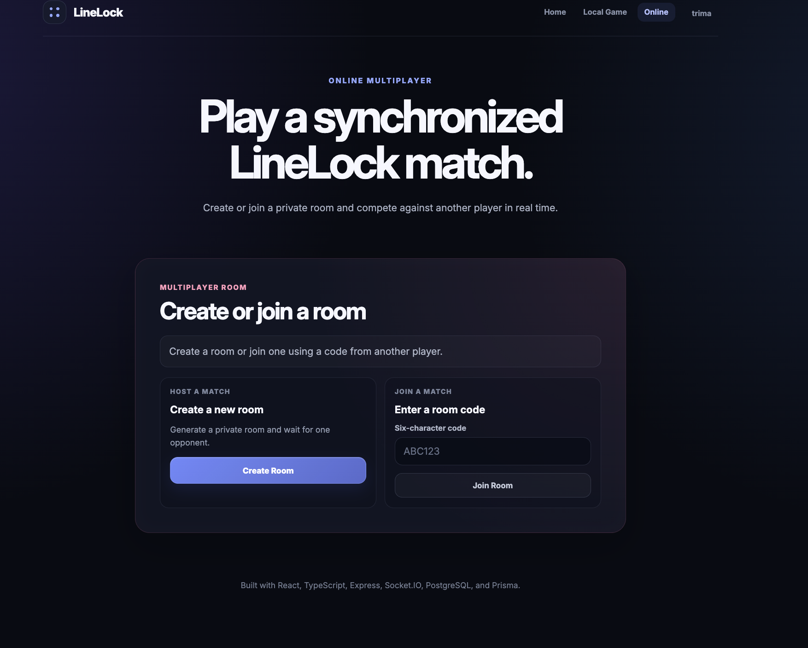
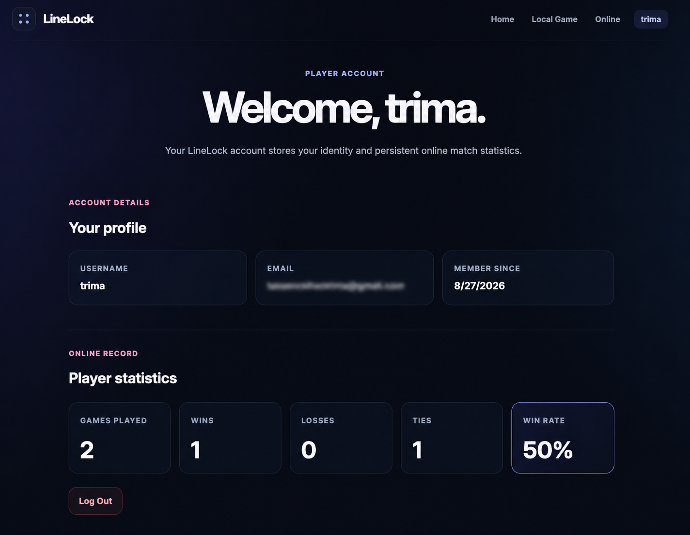

# LineLock

LineLock is a full-stack implementation of the classic **Dots and Boxes** strategy game with local gameplay, authenticated real-time multiplayer, persistent player statistics, and reconnection recovery.

Players take turns drawing lines between adjacent dots. When a player completes the fourth side of a box, they claim that box and immediately earn another turn. Once every possible box has been claimed, the player with the highest score wins.

## Live Application

**Frontend:** https://linelock.vercel.app

**Backend:** https://linelock.onrender.com

The frontend is deployed with Vercel, while the Express and Socket.IO backend is deployed with Render.

> The backend currently uses Render's free service tier and may take a short time to wake after a period of inactivity.

---

## Screenshots

### Home



### Local Game



### Online Multiplayer



### Player Statistics



---

## Project Status

✅ **Phase 15 — Statistics, Deployment & Documentation is complete.**

LineLock now includes:

- A React and TypeScript frontend
- An Express and TypeScript backend
- Client-side routing with React Router
- Configurable local two-player gameplay
- Real-time authenticated online multiplayer
- Private six-character multiplayer rooms
- Server-authoritative online game state
- Server-side move and turn validation
- Server-controlled edge and box ownership
- Automatic box detection and scoring
- Extra turns after completing a box
- Double-box completion support
- Winner and tie detection
- Online rematches
- Temporary disconnection recovery
- Thirty-second reconnection grace period
- Preserved multiplayer state during temporary disconnects
- Account-bound room recovery
- PostgreSQL-backed player accounts
- Prisma ORM database integration
- Secure bcrypt password hashing
- JWT-based authentication
- HTTP-only authentication cookies
- Persistent authenticated sessions
- Protected application routes
- Authenticated Socket.IO connections
- Persistent player statistics
- Games played, wins, losses, ties, and win-rate tracking
- Production frontend deployment with Vercel
- Production backend deployment with Render
- Hosted PostgreSQL database with Neon
- Responsive and accessible interfaces

---

## Features

### Local Gameplay

- Two-player local matches
- Custom player names
- Multiple board sizes
- Automatic box detection
- Extra turns after completing a box
- Double-box completion
- Live score tracking
- Winner and tie detection
- Match restart
- Responsive game board

### Online Multiplayer

- Private multiplayer rooms
- Six-character room codes
- Authenticated player identities
- Automatic account username usage
- Server-authoritative game state
- Server-side move validation
- Server-controlled turns
- Real-time board synchronization
- Server-controlled scoring
- Online winner and tie detection
- Host-controlled match startup
- Online rematches

### Reconnection Recovery

- Private recovery tokens
- Thirty-second reconnection grace period
- Preserved room membership during temporary disconnects
- Preserved game state during reconnection
- Preserved player positions
- Automatic recovery after Socket.IO reconnection
- Account-bound recovery validation
- Paused gameplay while a player reconnects
- Automatic cleanup after recovery timeout

### Authentication

- Persistent player accounts
- User registration
- User login and logout
- PostgreSQL account storage
- bcrypt password hashing
- JWT authentication
- HTTP-only authentication cookies
- Persistent browser sessions
- Protected routes
- Authenticated Socket.IO connections
- Server-controlled multiplayer identity

### Player Statistics

Each authenticated account stores persistent multiplayer statistics:

- Games played
- Wins
- Losses
- Ties
- Win rate

Statistics are updated when an online match finishes and remain available across sessions.

### Interface

- Responsive desktop and mobile layouts
- Authentication-aware navigation
- Dedicated account page
- Player profile information
- Statistics dashboard
- Multiplayer lobby states
- Live gameplay feedback
- Accessible form controls
- Keyboard-accessible interactions
- ARIA status announcements

---

## Technology Stack

### Frontend

- React
- TypeScript
- Vite
- React Router
- Socket.IO Client
- CSS

### Backend

- Node.js
- Express
- TypeScript
- Socket.IO
- bcrypt
- JSON Web Tokens
- Cookie-based authentication

### Database

- PostgreSQL
- Prisma ORM
- Neon PostgreSQL

### Deployment

- Vercel — frontend
- Render — backend
- Neon — PostgreSQL database

---

## Architecture

LineLock separates the application into three primary layers:

```text
React Client
     │
     ├── HTTP ──────────────► Express API
     │                         │
     │                         ▼
     │                    Prisma ORM
     │                         │
     │                         ▼
     │                     PostgreSQL
     │
     └── Socket.IO ─────────► Multiplayer Server
                               │
                               ▼
                      Authoritative Game State
```

The React frontend handles presentation and player interaction.

Express handles authentication and account-related HTTP requests.

Socket.IO manages real-time multiplayer rooms, game synchronization, and reconnection.

Prisma provides typed database access to the PostgreSQL database.

Online game state remains authoritative on the server so browsers cannot independently decide whether multiplayer moves are valid.

---

## Project Structure

```text
linelock/
├── client/
│   ├── src/
│   │   ├── auth/
│   │   ├── components/
│   │   ├── game/
│   │   ├── pages/
│   │   └── socket/
│   └── vercel.json
├── server/
│   ├── prisma/
│   │   ├── migrations/
│   │   └── schema.prisma
│   └── src/
│       ├── auth/
│       ├── generated/
│       └── lib/
├── CODING_JOURNAL.md
├── package.json
├── README.md
└── LICENSE
```

### Directory Overview

| Directory | Purpose |
|---|---|
| `client/` | React frontend application |
| `client/src/auth/` | Frontend authentication state and API communication |
| `client/src/components/` | Reusable interface and gameplay components |
| `client/src/game/` | Shared client game models and rules |
| `client/src/pages/` | Application pages and routes |
| `client/src/socket/` | Typed Socket.IO client |
| `server/` | Express and Socket.IO backend |
| `server/prisma/` | Prisma schema and database migrations |
| `server/src/auth/` | Authentication and authorization logic |
| `server/src/lib/` | Shared backend utilities |
| `CODING_JOURNAL.md` | Development log documenting each phase |
| `README.md` | Project documentation |

---

## Local Development

### Requirements

- Node.js
- npm
- PostgreSQL database

### Installation

Clone the repository:

```bash
git clone https://github.com/tassenraihantrima/LineLock.git

cd LineLock
```

Install dependencies:

```bash
npm install

npm install --prefix client

npm install --prefix server
```

Configure the required backend environment variables in:

```text
server/.env
```

The backend requires a PostgreSQL database connection and JWT authentication secret.

Generate the Prisma client:

```bash
cd server

npx prisma generate
```

Apply database migrations:

```bash
npx prisma migrate deploy

cd ..
```

Run the complete application:

```bash
npm run dev
```

Local development uses:

- Frontend: `http://localhost:5173`
- Backend: `http://localhost:3001`

---

## Authentication Architecture

LineLock uses persistent authenticated accounts for online multiplayer.

Passwords are hashed with bcrypt before being stored in PostgreSQL. After successful registration or login, the backend creates a signed JWT and stores it in an HTTP-only authentication cookie.

The React authentication provider restores the authenticated account when the application loads.

Socket.IO also validates authentication during its connection handshake. This allows the multiplayer server to associate each connection with a persistent database user instead of trusting player identity supplied by the browser.

Online room creation and joining automatically use the authenticated account's username.

Room recovery verifies both the private recovery credential and authenticated account identity before restoring a disconnected multiplayer position.

---

## Multiplayer Architecture

LineLock uses a server-authoritative multiplayer architecture.

The browser does not directly modify the online game state. Instead, it sends an edge request to the server.

The server then:

1. Identifies the authenticated player.
2. Locates the player's room.
3. Verifies that an active match exists.
4. Verifies that both players are connected.
5. Verifies that it is the player's turn.
6. Verifies that the requested edge exists.
7. Verifies that the edge is available.
8. Applies the move.
9. Detects completed boxes.
10. Updates scores and turn ownership.
11. Detects match completion.
12. Broadcasts the authoritative state to both players.

This keeps both browsers synchronized and prevents clients from controlling authoritative multiplayer data.

---

## Player Statistics

Player statistics are stored persistently in PostgreSQL.

The user database model tracks:

- Games played
- Wins
- Losses
- Ties

When an online match finishes, the server records the result for both authenticated players.

The account page displays these values along with a calculated win rate.

Because the statistics are stored in PostgreSQL, they remain available after logout, browser refreshes, server restarts, and future sessions.

---

## Production Deployment

### Frontend

The React application is deployed using **Vercel**.

Production frontend:

```text
https://linelock.vercel.app
```

Vite uses the production server URL through the `VITE_SERVER_URL` environment variable.

A Vercel rewrite configuration allows React Router routes such as `/online`, `/login`, `/register`, and `/account` to load directly.

### Backend

The Express and Socket.IO server is deployed using **Render**.

Production backend:

```text
https://linelock.onrender.com
```

The backend uses Render's assigned production port and allows the deployed Vercel frontend as an approved CORS origin.

Socket.IO uses the same deployed backend for real-time multiplayer communication.

### Database

Production account and statistics data are stored in a hosted **Neon PostgreSQL** database and accessed through Prisma ORM.

---

## Development Roadmap

- ✅ Phase 1 – Project Foundation
- ✅ Phase 2 – Game Models & Rules
- ✅ Phase 3 – Static Game Board
- ✅ Phase 4 – Clickable Edges
- ✅ Phase 5 – Player Turns
- ✅ Phase 6 – Box Detection
- ✅ Phase 7 – Game Completion
- ✅ Phase 8 – Local Game Polish
- ✅ Phase 9 – Application Routing
- ✅ Phase 10 – Socket.IO Integration
- ✅ Phase 11 – Online Rooms
- ✅ Phase 12 – Server-Controlled Game State
- ✅ Phase 13 – Reconnection Handling
- ✅ Phase 14 – Authentication & Database
- ✅ Phase 15 – Statistics, Deployment & Documentation

---

## Future Improvements

The fifteen-phase development roadmap is complete. Possible future additions include:

- Match history
- Leaderboards
- Player rankings
- Achievement system
- Spectator mode
- Sound effects
- Additional animations and interface polish
- Additional multiplayer customization

These are optional extensions rather than requirements for the completed development roadmap.

---

## Development Journal

The complete development process is documented in **`CODING_JOURNAL.md`**.

The journal records:

- Features implemented during each phase
- Technologies used
- Architecture decisions
- Concepts learned
- Problems and debugging
- Testing performed
- Development milestones

---

## License

This project is licensed under the MIT License.